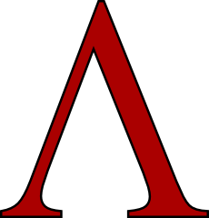

# lambda

<div align="right">

</div>

Basic untyped lambda-calculus interpreter with Parsec.

```
(variable)    => x
(abstraction) => λ(variable).(variable, abstraction, application)
(application) => (variable,abstraction)(variable,abstraction) 
```

## How to run
```
cabal v2-run
```

## Usage
Algebraic data type for lambda-calculus parser.
```hs
data Lambda = Var Char | Abs Char Lambda | App Lambda Lambda deriving Show
```
```
Var => Variable
Abs => Abstraction
App => Application
```

#### Quit
To quit program, you have to type: 
```
λ> quit
```

#### Examples
```
λ> x
β> Var 'x'
```

```
λ> λx.x
β> Abs 'x' (Var 'x')
```

```
λ> λx.λy.xy
# or
λ> λxy.xy

β> Abs 'x' (Abs 'y' (App (Var 'x') (Var 'y')))
```

```
λ> xf
β> App (Var 'x') (Var 'f')
```

```
λ> (λx.x)(z)  
β> Var 'z'
```

```
λ> (λx.λy.x)(z)
β> Abs 'y' (Var 'z')
```

```
λ> (λx.xx)(z)
β> App (Var 'z') (Var 'z')
```

```
λ> (λx.x)(λz.z)
β> Abs 'z' (Var 'z')
```

```
λ> (λx.x)(xf)
β> App (Var 'x') (Var 'f')
```

```
# Shadowing
λ> (λx.λx.x)(z)
β> Abs 'x' (Var 'x')
```